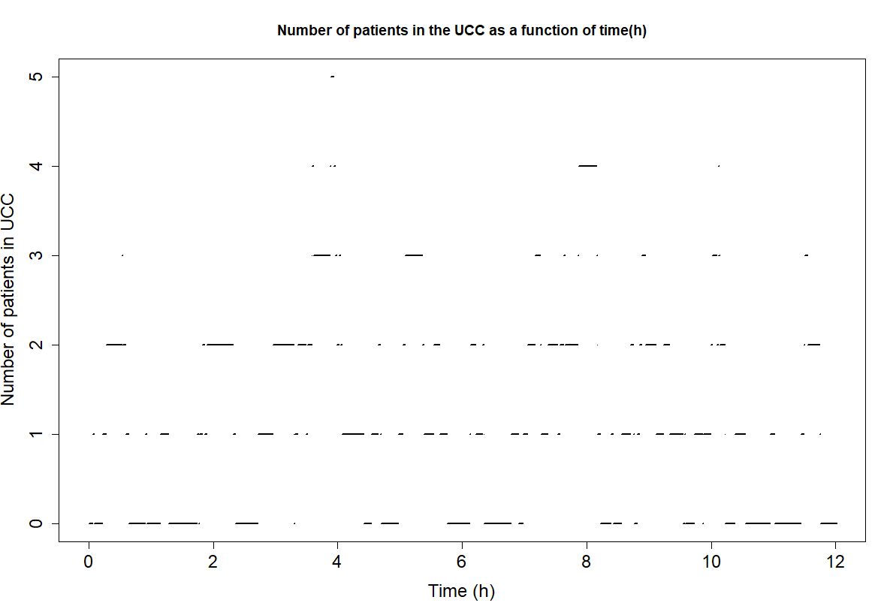
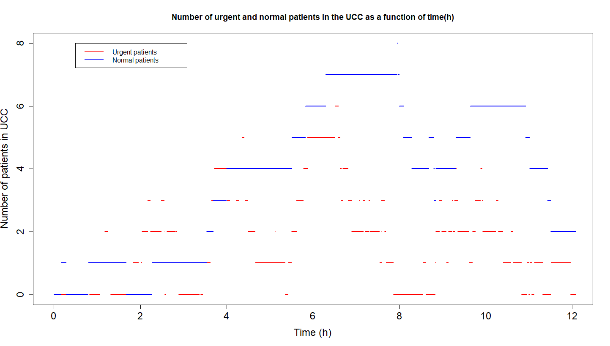

# Stochastic Modeling for Healthcare Analytics and Bayesian Optimization

## Overview

This project explores the application of advanced stochastic methods to two critical domains: healthcare system optimization and parameter estimation under uncertainty. I developed comprehensive models for analyzing urgent care center operations using birth-death Markov chains, examining patient flow dynamics, waiting times, and the impact of priority-based service policies. Additionally, I implemented Gaussian process models with exponential correlation structures for Bayesian optimization and uncertainty quantification in parameter spaces. The work demonstrates practical applications of stochastic modeling techniques to real-world problems, providing actionable insights for healthcare system management and robust methods for parameter optimization under uncertainty.

## Mathematical Formulation

### Healthcare Queueing Analysis

The urgent care center is modeled as a continuous-time Markov chain with state space $\mathcal{S} = \{0, 1, 2, \ldots\}$ representing the number of patients in the system.

**State Variables:**
- $X(t)$: Number of patients in UCC at time $t$
- $X_U(t)$: Number of urgent patients at time $t$ 
- $X_N(t)$: Number of normal patients at time $t$

**Parameters:**
- $\lambda = 5$ patients/hour: arrival rate
- $\mu = 6$ patients/hour: service rate  
- $p = 0.8$: probability that arriving patient is urgent

**Birth-Death Process:**
For the basic M/M/1 system:
$$q_{i,i+1} = \lambda, \quad q_{i,i-1} = \mu \quad \text{for } i \geq 1$$
$$q_{0,1} = \lambda$$

For the priority system, urgent patients are served before normal patients, with transition rates:
$$q_{(i,j),(i+1,j)} = p\lambda, \quad q_{(i,j),(i,j+1)} = (1-p)\lambda$$
$$q_{(i,j),(i-1,j)} = \mu \text{ if } i > 0, \quad q_{(0,j),(0,j-1)} = \mu \text{ if } j > 0$$

**Performance Measures:**
Using Little's Law and long-run analysis:
$$W = \frac{L}{\lambda}, \quad L = \lim_{t \to \infty} \mathbb{E}[X(t)]$$

For the M/M/1 system: $W = \frac{1}{\mu - \lambda}$

For urgent patients in priority system: $W_U = \frac{1}{\mu - p\lambda}$

For normal patients in priority system: $W_N = \frac{\mu}{(\mu - \lambda)(\mu - p\lambda)}$

### Gaussian Process Modeling

**Prior Process:**
$$y(\theta) \sim \mathcal{GP}(m(\theta), k(\theta, \theta'))$$

**Mean Function:**
$$m(\theta) = 0.5$$

**Covariance Function:**
$$k(\theta, \theta') = \sigma^2 (1 + 15|\theta - \theta'|) \exp(-15|\theta - \theta'|)$$
where $\sigma^2 = 0.5^2$.

**Posterior Distribution:**
Given observations $\mathcal{D} = \{(\theta_i, y_i)\}_{i=1}^n$, the posterior is:
$$y(\theta^*) | \mathcal{D} \sim \mathcal{N}(\mu_{\mathcal{D}}(\theta^*), \sigma^2_{\mathcal{D}}(\theta^*))$$

where:
$$\mu_{\mathcal{D}}(\theta^*) = m(\theta^*) + k(\theta^*, \Theta)[K + \sigma^2_n I]^{-1}(y - m)$$
$$\sigma^2_{\mathcal{D}}(\theta^*) = k(\theta^*, \theta^*) - k(\theta^*, \Theta)[K + \sigma^2_n I]^{-1}k(\Theta, \theta^*)$$

**Optimization Objective:**
Maximize $\Pr[y(\theta) < 0.3]$ over $\theta \in [0.25, 0.50]$.

## Method and Algorithms

### Healthcare Queueing Implementation
1. **State Generation**: Use exponential inter-event times with rates $\lambda + \mu$ for non-empty states
2. **Event Selection**: Bernoulli trial with probability $\frac{\lambda}{\lambda + \mu}$ for arrivals vs departures  
3. **Priority Logic**: Departures always serve urgent patients first when available
4. **Performance Estimation**: Track sojourn times and apply Little's Law for waiting time estimation
5. **Statistical Analysis**: Monte Carlo estimation with confidence intervals using t-distribution

### Gaussian Process Implementation
1. **Correlation Matrix Construction**: Compute $n \times n$ covariance matrix using exponential correlation function
2. **Cholesky Decomposition**: Factor covariance matrix for efficient sampling: $L L^T = \Sigma$
3. **Posterior Computation**: Solve linear systems for conditional mean and covariance
4. **Uncertainty Quantification**: Generate prediction intervals using posterior variance
5. **Optimization**: Evaluate acquisition function $\Pr[y(\theta) < 0.3]$ over parameter grid

## Repository Structure

```
├── README.md                           # This file
├── requirements.txt                    # R package dependencies
├── project2.pdf                        # Project specification
├── queueing_basic.R                    # M/M/1 queueing system simulation
├── queueing_priority.R                 # Priority queueing system simulation  
├── gaussian_process.R                  # Gaussian process modeling and optimization
├── total_patients_12hours.png         # Visualization of patient counts over time
└── urgent_normal_patients_12hours.png # Visualization of priority queue dynamics
```

## Quick Start

### Environment Setup
Ensure R is installed with the required packages:
```bash
# Install R dependencies
R -e "install.packages(c('ggplot2', 'reshape2', 'latex2exp'))"
```

### Minimal Run Commands
```bash
# Run basic queueing analysis
Rscript queueing_basic.R

# Run priority queueing analysis  
Rscript queueing_priority.R

# Run Gaussian process modeling
Rscript gaussian_process.R
```

## Reproducing Results

### Healthcare Queueing Results
To reproduce the queueing analysis with consistent results:

```bash
# Basic M/M/1 system
R -e "set.seed(42); source('queueing_basic.R')"

# Priority queueing system
R -e "set.seed(42); source('queueing_priority.R')"
```

**Expected Outputs:**
- Average waiting time estimates with 95% confidence intervals
- State probability distributions  
- Time series plots of patient counts over 12-hour periods

### Gaussian Process Results
```bash
# GP modeling with 5 and 6 evaluation points
R -e "set.seed(42); source('gaussian_process.R')"
```

**Expected Outputs:**
- Posterior mean predictions with 90% prediction intervals
- Optimization results showing maximum probability locations
- Comparison plots between 5 and 6 evaluation point scenarios

### Key Parameters for Reproduction
- **Simulation Length**: 50 days (1200 hours) for steady-state analysis
- **Monte Carlo Runs**: 30 simulations for confidence interval estimation
- **GP Grid**: $\theta \in [0.25, 0.50]$ with step size 0.005
- **Prediction Interval**: 90% confidence level
- **Optimization Threshold**: $y(\theta) < 0.3$

## Figures

### Queueing System Dynamics

*Time evolution of patient count in the basic M/M/1 queueing system over a 12-hour period, showing the stochastic nature of arrivals and departures.*

  
*Comparison of urgent (red) and normal (blue) patient counts in the priority queueing system, demonstrating the preferential treatment of urgent cases.*

These visualizations illustrate the real-time dynamics of the healthcare queueing systems, showing how patient loads fluctuate and how priority schemes affect service patterns.